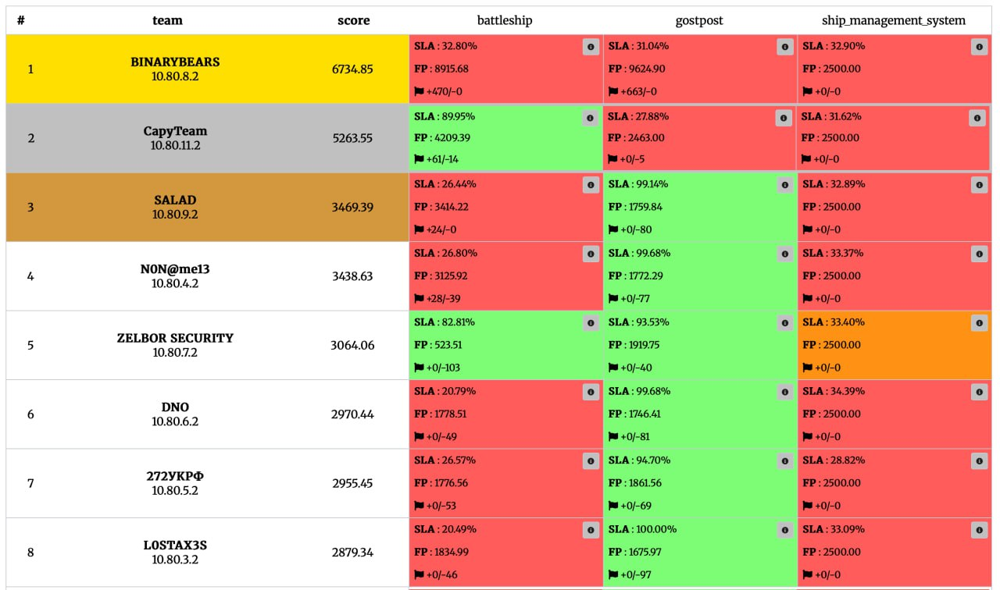
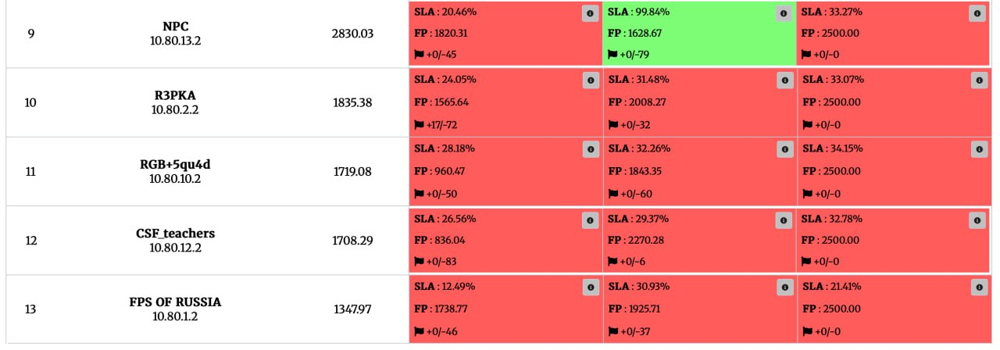

# CenterCTF 
Соревнования проходили 18 мая в  offline-формате при поддержке Минцифры и Воронежского Государственного Университета (Факультет компьютерных наук) на площадке Дворца творчества и юности. В соревновании приняли участие 10 лучших команд, отобранных жюри соревнований

[Сайт соревнований](https://centerctf.ru)  
[Caйт чемпионата](https://cybercraft.ru)

## Scoreboard

